Thermimage: Thermal Image Analysis 
================

[](https://www.r-pkg.org/badges/version/Thermimage) [](https://cranlogs.r-pkg.org/badges/Thermimage) [](https://cranlogs.r-pkg.org/badges/grand-total/Thermimage) [](http://depsy.org/package/r/Thermimage) [](https://zenodo.org/badge/latestdoi/33262273)

A collection of functions for assisting in converting extracted raw data from infrared thermal images and converting them to estimated temperatures using standard equations in thermography. Provides an open source proxy tool for assisting with infrared thermographic analysis. Ongoing development in file conversion to facilitate transfer to ImageJ.

The version here on github is the current, development version. Archived sources can be found at CRAN: <https://cran.r-project.org/src/contrib/Archive/Thermimage/>

Current release notes 
=====================

- 2019-03-06: Version 3.1.4 is on Github (development version)
    - Fixed an issue (#2) with __frameLocates()__.  This function may not remain in the package in the future, especially if file types change.  Recommend users consider __convertflirVID()__ or __convertflirJPG()__ instead to convert files to an easier to import file type.


Features 
========

-   Functions for importing FLIR image and video files (limited) into R.
-   Functions for converting thermal image data from FLIR based files, incorporating calibration information stored within each radiometric image file.
-   Functions for exporting calibrated thermal image data for analysis in open source platforms, such as ImageJ.
-   Functions for running command line conversion tools to prepare FLIR thermal image files for direct import into ImageJ.
-   Functions for steady state estimates of heat exchange from surface temperatures estimated by thermal imaging.
-   Functions for modelling heat exchange under various convective, short-wave, and long-wave radiative heat flux, useful in thermal ecology studies.

How to Cite
===========

Glenn J. Tattersall. (2017, December 3). Thermimage: Thermal Image Analysis.doi: 10.5281/zenodo.1069705 (URL: <http://doi.org/10.5281/zenodo.1069705>), R package version 3.1.0, &lt;URL: <https://CRAN.R-project.org/package=Thermimage>&gt;. [](https://zenodo.org/badge/latestdoi/33262273)

Installation 
============

On current R (&gt;= 3.0.0)
--------------------------
 
-   From CRAN (stable releases 1.0.+):

``` r
# install.packages("Thermimage", repos='http://cran.us.r-project.org')
```

-   Development version from Github:

``` r
# library("devtools"); install_github("gtatters/Thermimage",dependencies=TRUE)
```

Package Imports
---------------

-   Imports: tiff, png

-   Suggests: ggplot2, fields, reshape

OS Requirements
---------------

-   Thermimage was developed on OSX, and works well on Linux. Many features in Windows will require installation of command line tools that may or may not work as effectively. The internal R functions should operate fine in Windows.
-   Exiftool is required for certain functions. Installation instructions can be found here: <http://www.sno.phy.queensu.ca/~phil/exiftool/install.html>
-   Imagemagick is required for certain functions. Installation instructions can be found here: <https://www.imagemagick.org/script/download.php>
-   Perl is required for certain functions. Installation instructions can be found here: <https://www.perl.org/get.html>

Import, Export, Image Processing
================================

A typical thermal image
-----------------------


Normally, these thermal images require access to software that only runs on Windows operating system. This package will allow you to import certain FLIR jpgs and videos and process the images in R, and thus is platform independent.

Import FLIR JPG
---------------

To load a FLIR JPG, you first must install Exiftool as per instructions above. Open sample flir jpg included with Thermimage package:

``` r
library(Thermimage)
f<-paste0(system.file("extdata/IR_2412.jpg", package="Thermimage"))
img<-readflirJPG(f, exiftoolpath="installed")
dim(img)
```

    ## [1] 480 640

The readflirJPG function has used Exiftool to figure out the resolution and properties of the image file. Above you can see the dimensions are listed as 480 x 640. Before plotting or doing any temperature assessments, let's extract the meta-tages from the thermal image file.

Extract meta-tags from thermal image file
-----------------------------------------

``` r
cams<-flirsettings(f, exiftoolpath="installed", camvals="")
head(cbind(cams$Info), 20) # Large amount of Info, show just the first 20 tages for readme
```

    ##                       [,1]    
    ## ExifToolVersionNumber 10.67   
    ## FileName              2412    
    ## Directory             ".3.5"  
    ## FileSize              638     
    ## FilePermissions       "-"     
    ## FileType              ""      
    ## FileTypeExtension     ""      
    ## MIMEType              ""      
    ## JFIFVersion           1.01    
    ## ExifByteOrder         "-"     
    ## Make                  ""      
    ## CameraModelName       660     
    ## Orientation           ""      
    ## XResolution           72      
    ## YResolution           72      
    ## ResolutionUnit        ""      
    ## Software              "1.1.98"
    ## YCbCrPositioning      ""      
    ## ExposureTime          133     
    ## ExifVersion           220

This produes a rather long list of meta-tags. If you only want to see your camera calibration constants, type:

``` r
plancks<-flirsettings(f, exiftoolpath="installed", camvals="-*Planck*")
unlist(plancks$Info)
```

    ##      PlanckR1       PlanckB       PlanckF       PlanckO      PlanckR2 
    ##  2.110677e+04  1.501000e+03  1.000000e+00 -7.340000e+03  1.254526e-02

If you want to check the file data information, type:

``` r
cbind(unlist(cams$Dates))
```

    ##                          [,1]                 
    ## FileModificationDateTime "2018-11-05 17:57:42"
    ## FileAccessDateTime       "2019-02-12 14:20:55"
    ## FileInodeChangeDateTime  "2019-01-26 17:04:55"
    ## ModifyDate               "2013-05-09 16:22:23"
    ## CreateDate               "2013-05-09 16:22:23"
    ## DateTimeOriginal         "2013-05-09 22:22:23"

or just:

``` r
cams$Dates$DateTimeOriginal
```

    ## [1] "2013-05-09 22:22:23"

The most relevant variables to extract for calculation of temperature values from raw A/D sensor data are listed here. These can all be extracted from the cams output as above. I have simplified the output below, since dealing with lists can be awkward.

``` r
ObjectEmissivity<-  cams$Info$Emissivity              # Image Saved Emissivity - should be ~0.95 or 0.96
dateOriginal<-cams$Dates$DateTimeOriginal             # Original date/time extracted from file
dateModif<-   cams$Dates$FileModificationDateTime     # Modification date/time extracted from file
PlanckR1<-    cams$Info$PlanckR1                      # Planck R1 constant for camera  
PlanckB<-     cams$Info$PlanckB                       # Planck B constant for camera  
PlanckF<-     cams$Info$PlanckF                       # Planck F constant for camera
PlanckO<-     cams$Info$PlanckO                       # Planck O constant for camera
PlanckR2<-    cams$Info$PlanckR2                      # Planck R2 constant for camera
OD<-          cams$Info$ObjectDistance                # object distance in metres
FD<-          cams$Info$FocusDistance                 # focus distance in metres
ReflT<-       cams$Info$ReflectedApparentTemperature  # Reflected apparent temperature
AtmosT<-      cams$Info$AtmosphericTemperature        # Atmospheric temperature
IRWinT<-      cams$Info$IRWindowTemperature           # IR Window Temperature
IRWinTran<-   cams$Info$IRWindowTransmission          # IR Window transparency
RH<-          cams$Info$RelativeHumidity              # Relative Humidity
h<-           cams$Info$RawThermalImageHeight         # sensor height (i.e. image height)
w<-           cams$Info$RawThermalImageWidth          # sensor width (i.e. image width)
```

Convert raw binary to temperature
---------------------------------

Now you have the img loaded, look at the values:

``` r
str(img)
```

    ##  int [1:480, 1:640] 18090 18074 18064 18061 18081 18057 18092 18079 18071 18071 ...

If stored with a TIFF header, the data load in as a pre-allocated matrix of the same dimensions of the thermal image, but the values are integers values, in this case ~18000. The data are stored as in binary/raw format at 2^16 bits of resolution = 65535 possible values, starting at 1. These are not temperature values. They are, in fact, radiance values or absorbed infrared energy values in arbitrary units. That is what the calibration constants are for. The conversion to temperature is a complicated algorithm, incorporating Plank's law and the Stephan Boltzmann relationship, as well as atmospheric absorption, camera IR absorption, emissivity and distance to namea few. Each of these raw/binary values can be converted to temperature, using the raw2temp function:

``` r
temperature<-raw2temp(img, ObjectEmissivity, OD, ReflT, AtmosT, IRWinT, IRWinTran, RH,
                      PlanckR1, PlanckB, PlanckF, PlanckO, PlanckR2)
str(temperature)      
```

    ##  num [1:480, 1:640] 23.7 23.6 23.6 23.6 23.7 ...

The raw binary values are now expressed as temperature in degrees Celsius (apologies to Lord Kelvin). Let's plot the temperature data:

``` r
library(fields) # should be imported when installing Thermimage
```

    ## Loading required package: spam

    ## Loading required package: dotCall64

    ## Loading required package: grid

    ## Spam version 2.2-1 (2018-12-20) is loaded.
    ## Type 'help( Spam)' or 'demo( spam)' for a short introduction 
    ## and overview of this package.
    ## Help for individual functions is also obtained by adding the
    ## suffix '.spam' to the function name, e.g. 'help( chol.spam)'.

    ## 
    ## Attaching package: 'spam'

    ## The following objects are masked from 'package:base':
    ## 
    ##     backsolve, forwardsolve

    ## Loading required package: maps

    ## See www.image.ucar.edu/~nychka/Fields for
    ##  a vignette and other supplements.

``` r
plotTherm(temperature, h=h, w=w, minrangeset=21, maxrangeset=32)
```

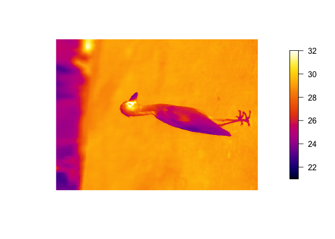

The FLIR jpg imports as a matrix, but default plotting parameters leads to it being rotated 270 degrees (counter clockwise) from normal perspective, so you should either rotate the matrix data before plotting, or include the rotate270.matrix transformation in the call to the plotTherm function:

``` r
plotTherm(temperature, w=w, h=h, minrangeset = 21, maxrangeset = 32, trans="rotate270.matrix")
```

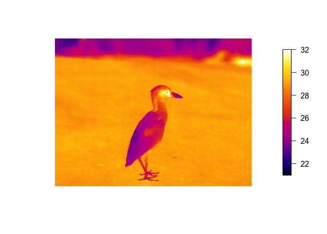

If you prefer a different palette:

``` r
plotTherm(temperature, w=w, h=h, minrangeset = 21, maxrangeset = 32, trans="rotate270.matrix", 
          thermal.palette=rainbowpal)
```


``` r
plotTherm(temperature, w=w, h=h, minrangeset = 21, maxrangeset = 32, trans="rotate270.matrix", 
          thermal.palette=glowbowpal)
```

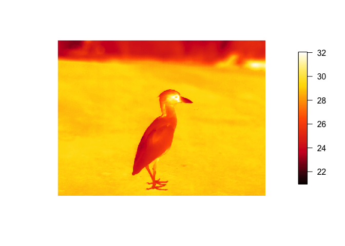

``` r
plotTherm(temperature, w=w, h=h, minrangeset = 21, maxrangeset = 32, trans="rotate270.matrix", 
          thermal.palette=midgreypal)
```

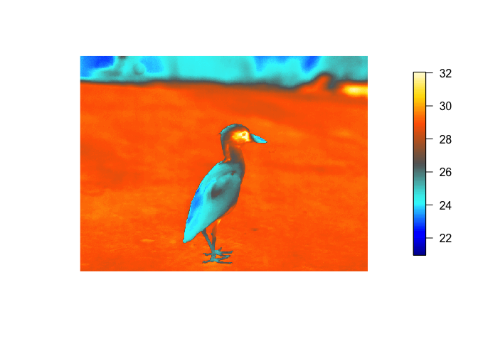

``` r
plotTherm(temperature, w=w, h=h, minrangeset = 21, maxrangeset = 32, trans="rotate270.matrix", 
          thermal.palette=midgreenpal)
```

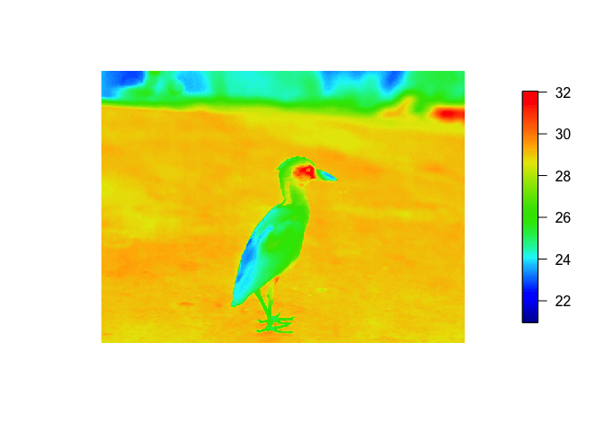

``` r
plotTherm(temperature, w=w, h=h, minrangeset = 21, maxrangeset = 32, trans="rotate270.matrix", 
          thermal.palette=rainbow1234pal)
```

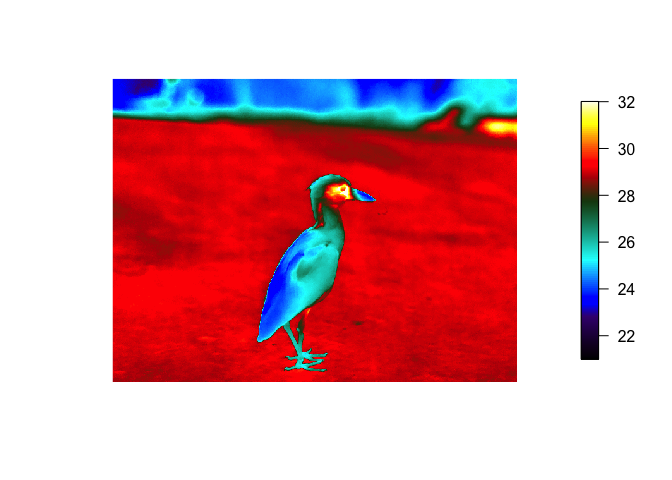

Deconvolute temperature to raw and back to temperature
------------------------------------------------------

With thermal imaging analysis, there are at least 7 environmental parameters that must be known to convert raw to temperature. Sometimes, the parameters might have been incorrectly input by the user or changing the parameters is too cumbersome in the commercial software. temp2raw() is the inverse of raw2temp(), which allows you to convert an estimated temperature back to the raw values (i.e. deconvolute), using the initial object parameters used.

For example, convert a temperature estimated at 23 degrees C, under the default blackbody conditions:

``` r
temp2raw(23, E=1, OD=0, RTemp=20, ATemp=20, IRWTemp=20, IRT=1, RH=50, PR1=21106.77, PB=1501, PF=1, PO=-7340, PR2=0.012545258)
```

    ## [1] 17994.06

Which yields a raw value of 17994.06 (using the calibration constants above). Now you can use raw2temp to calculate a better estimate of an object that has emissivity=0.95, distance=1m, window transmission=0.96, all temperatures=20C, 50 RH:

``` r
raw2temp(17994.06, E=0.95, OD=1, RTemp=20, ATemp=20, IRWTemp=20, IRT=0.96, RH=50, PR1=21106.77, PB=1501, PF=1, PO=-7340, PR2=0.012545258)
```

    ## [1] 23.31223

Note: the default calibration constants for my FLIR camera will be used if you leave out the calibration data during this two step process, but it is more appropriate to look up your camera's calibrations constants using the flirsettings() function.

How accurate is the raw2temp() conversion
-----------------------------------------

See the following github for an explanation and break-down of the conversion process and comparison to existing commercial software:

<https://github.com/gtatters/ThermimageCalibration>

Export Image or Video
---------------------

Finding a way to quantitatively analyse thermal images in R is a challenge due to limited interactions with the graphics environment. Thermimage has a function that allows you to write the image data to a file format that can be easily imported into ImageJ.

First, the image matrix needs to be transposed (t) to swap the row vs. column order in which the data are stored, then the temperatures need to be transformed to a vector, a requirement of the writeBin function. The function writeFlirBin is a wrapper for writeBin, and uses information on image width, height, frame number and image interval (the latter two are included for thermal video saves) but are kept for simplicity to contruct a filename that incorporates image information required when importing to ImageJ:

``` r
writeFlirBin(as.vector(t(temperature)), templookup=NULL, w=w, h=h, I="", rootname="Uploads/FLIRjpg")
```

The raw file can be found here: <https://github.com/gtatters/Thermimage/blob/master/Uploads/FLIRjpg_W640_H480_F1_I.raw?raw=true>

Import Raw File into ImageJ
---------------------------

The .raw file is simply the pixel data saved in raw format but with real 32-bit precision. This means that the temperature data (negative or positive values) are encoded in 4 byte chunks. ImageJ has a plethora of import functions, and the File--&gt;Import--&gt;Raw option provides great flexibility. Once opening the .raw file in ImageJ, set the width, height, number of images (i.e. frames or stacks), byte storage order (little endian), and hyperstack (if desired):


The image imports clearly just as it would in a thermal image program. Each pixel stores the calculated temperatures as provided from the raw2temp function above.


Importing Thermal Videos
------------------------

Importing thermal videos (March 2017: still in development) is a little more involved and less automated, but below are steps that have worked for seq and fcf files tested.

Set file info and extract meta-tags as done above:

``` r
# set filename as v
v<-paste0(system.file("extdata/SampleSEQ.seq", package="Thermimage"))

# Extract camera values using Exiftool (needs to be installed)
camvals<-flirsettings(v)
w<-camvals$Info$RawThermalImageWidth
h<-camvals$Info$RawThermalImageHeight
```

Create a lookup variable to convert the raw binary to actual temperature estimates, use parameters relevant to the experiment. You could use the values stored in the FLIR meta-tags, but these are not necessarily correct for the conditions of interest. suppressWarnings() is used because of NaN values returned for binary values that fall outside the range.

``` r
suppressWarnings(
templookup<-raw2temp(raw=1:65535, E=camvals$Info$Emissivity, OD=camvals$Info$ObjectDistance, RTemp=camvals$Info$ReflectedApparentTemperature, ATemp=camvals$Info$AtmosphericTemperature, IRWTemp=camvals$Info$IRWindowTemperature, IRT=camvals$Info$IRWindowTransmission, RH=camvals$Info$RelativeHumidity, PR1=camvals$Info$PlanckR1,PB=camvals$Info$PlanckB,PF=camvals$Info$PlanckF,PO=camvals$Info$PlanckO,PR2=camvals$Info$PlanckR2)
)
plot(templookup, type="l", xlab="Raw Binary 16 bit Integer Value", ylab="Estimated Temperature (C)")
```

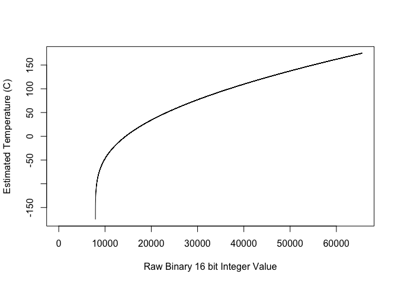

The advantage of using the templookup variable is in its index capacity. For computations involving large files, this is most efficient way to convert the raw binary values rapidly without having to call the raw2temp function repeatedly. Thus, for a raw binary value of 17172, 18273, and 24932:

``` r
templookup[c(17172, 18273, 24932)]
```

    ## [1] 18.30964 24.77935 57.07821

We will use the templookup later on, but first to detect where the image frames can be found in the video file. Using the width and height information, we use this to find where in the video file these are stored. This corresponds to reproducible locations in the frame header:

``` r
fl<-frameLocates(v, w, h)
n.frames<-length(fl$f.start)
n.frames; fl
```

    ## [1] 2

    ## $h.start
    ## [1]    162 308688
    ## 
    ## $f.start
    ## [1]   1391 309917

The relative positions of the header start (h.start) are 162 and 308688, and the frame start (f.start) positions are 1391 and 309917. The video file is a short, two frame (n.frames) sequence from a thermal video.

Then pass the fl data to two different functions, one to extract the time information from the header, and the other to extract the actual pixel data from the image frame itself. The lapply function will have to be used (for efficiency), but to wrap the function across all possible detected image frames. Note: For large files, the parallel function, mclapply, is advised (?getFrames for an example):

``` r
extract.times<-do.call("c", lapply(fl$h.start, getTimes, vidfile=v))
data.frame(extract.times)
```

    ##             extract.times
    ## 1 2012-06-13 15:52:08.698
    ## 2 2012-06-13 15:52:12.665

``` r
Interval<-signif(mean(as.numeric(diff(extract.times))),3)
Interval
```

    ## [1] 3.97

This particluar sequence was actually captured at 0.03 sec intervals, but the sample file in the package was truncated to only two frames to minimise online size requirements for CRAN. At present, the getTimes function cannot accurately render the time on the first frame. On the original 100 frame file, it accurately captures the real time stamps, so the error is appears to be how FLIR saves time stamps (save time vs. modification time vs. original time appear highly variable in .seq and .fcf files). Precise time capture is not crucial but is helpful for verifying data conversion.

After extracting times, then extract the frame data, with the getFrames function:

``` r
alldata<-unlist(lapply(fl$f.start, getFrames, vidfile=v, w=w, h=h))
class(alldata); length(alldata)/(w*h)
```

    ## [1] "integer"

    ## [1] 2

The raw binary data are stored as an integer vector. length(alldata)/(w\*h) verifies the total \# of frames in the video file is 2.

It is best to convert the temperature data in the following manner, although depending on file size and system limits, you may wish to delay converting to temperature until writing the file.

``` r
alltemperature<-templookup[alldata]
head(alldata)
```

    ## [1] 17870 17833 17808 17829 17829 17861

``` r
head(alltemperature)
```

    ## [1] 22.46279 22.24723 22.10131 22.22390 22.22390 22.41040

I recommend converting the binary and/or temperature variables to a matrix class, where each column represents a separate image frame, while the individual rows correspond to unique pixel positions. Pixels are filled into the row values the same way across all frames. Dataframes and arrays are much slower for processing large files.

``` r
alldata<-unname(matrix(alldata, nrow=w*h, byrow=FALSE))
alltemperature<-unname(matrix(alltemperature, nrow=w*h, byrow=FALSE))
dim(alltemperature)
```

    ## [1] 307200      2

Frames extracted from thermal vids are upside down, so use the mirror.matrix function inside the plotTherm function.

``` r
plotTherm(alltemperature[,1], w=w, h=h, trans="mirror.matrix")
```

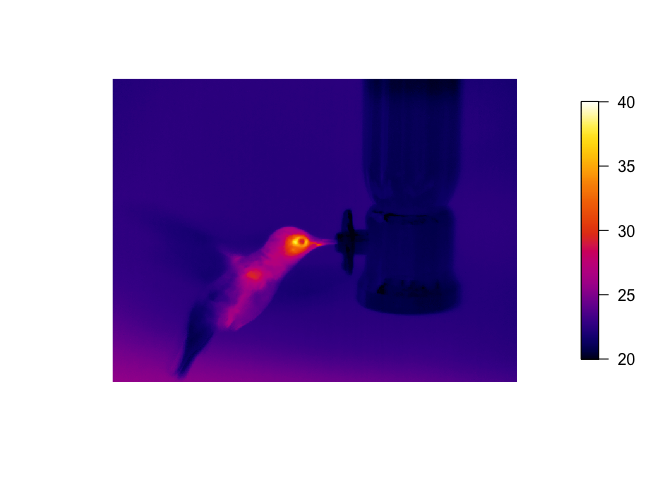

``` r
plotTherm(alltemperature[,2], w=w, h=h, trans="mirror.matrix")
```

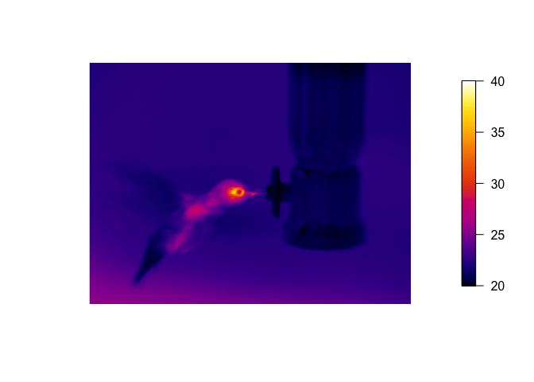

These files can be found:

<https://github.com/gtatters/Thermimage/blob/master/Uploads/SampleSEQ1.png?raw=true> <https://github.com/gtatters/Thermimage/blob/master/Uploads/SampleSEQ2.png?raw=true>

Now, export entire sequence to a raw bin for opening in ImageJ - smallish file size

``` r
writeFlirBin(bindata=alldata, templookup, w, h, Interval, rootname="Uploads/SampleSEQ")
```

The newly written 32-bit video file (<https://github.com/gtatters/Thermimage/blob/master/Uploads/SampleSEQ_W640_H480_F2_I3.97.raw?raw=true>) can now be imported into ImageJ, as desribed above for the single image. Each frame is converted into a stack in ImageJ.

Note: 32-bit video files can be large and difficult to load into ImageJ. Approaches involving direct import of flir video files is recommended and under development.

Convert FLIR JPG from R
=======================

If you have a lot of files and wish simply to analyse images in ImageJ, not in R, then you will want to bulk convert these files. The following methods are available in R, but are based on command line tools that are also described in <https://github.com/gtatters/Thermimage/blob/master/BashConvertFLIR.md>

### Download and extract sample files to SampleFLIR folder:

<https://github.com/gtatters/Thermimage/blob/master/Uploads/SampleFLIR.zip>

``` bash
cd ~/IRconvert/SampleFLIR
ls
```

    ## CSQconverted.avi
    ## SEQconverted.avi
    ## SEQconvertedjpegls.avi
    ## SEQconvertedpng.avi
    ## SampleFLIR.csq
    ## SampleFLIR.jpg
    ## SampleFLIR.seq
    ## output

### Download and extract perl scripts to scripts folder:

<https://github.com/gtatters/Thermimage/blob/master/Uploads/perl.zip>

``` bash
cd ~/IRconvert/scripts
ls
```

    ## ConvertCSQtoAVI
    ## ConvertFCFtoAVI
    ## ConvertFLIRJPGtoRAW
    ## ConvertFLIRJPGtoTIFF
    ## ConvertFLIRRAWtoTIFF
    ## ConvertSEQtoAVI
    ## ConverttoGrayscale
    ## ExtractAllFLIRJPGs
    ## IRFileImport.R
    ## ImageJRad2Temp.txt
    ## ImportRaw_FCFsettings.jpeg
    ## Process_Folder GUI mod.ijm
    ## Process_Folder.ijm
    ## Process_Folder_TIFF2Temp.ijm
    ## exiftool commands.docx
    ## imagejscript_rad2temp
    ## split.pl
    ## split_fff.pl
    ## split_jpegls.pl
    ## split_tiff.pl
    ## test.pl
    ## test2.pl
    ## workflow.txt
    ## workflow_windows.txt

Bulk convert all FLIR jpg files found in folder:

``` r
library(Thermimage)
setwd("~/IRconvert/SampleFLIR")
exiftoolpath <- "installed"

l.files<-list.files(pattern=".jpg", recursive=T, full.names=F, include.dirs=T, no..=T)
l.files
```

    ## [1] "SampleFLIR.jpg"

``` r
# if JPG contains raw thermal image as TIFF, endian = "lsb"
# if JPG contains raw thermal image as PNG, endian = "msb"?

for(f in l.files){
  imagefile<-f
  vals<-flirsettings(imagefile)
  w<-vals$Info$ImageWidth
  h<-vals$Info$ImageHeight
  res.in<-paste0(w,"x",h)
  
  if(vals$Info$RawThermalImageType=="PNG") endian="msb"
  if(vals$Info$RawThermalImageType=="TIFF") endian="lsb"
  
  convertflirJPG(imagefile, exiftoolpath="installed", res.in=res.in, endian=endian, outputfolder="output", verbose=FALSE)
  cat("\n")
}
```

Converted files are in output folder:

``` bash
cd ~/IRconvert/SampleFLIR
ls output/
```

    ## JPGconverted.png
    ## SampleFLIR.csq.avi
    ## SampleFLIR.png
    ## frame00001.png
    ## frame00002.png
    ## frame00003.png
    ## frame00004.png
    ## frame00005.png
    ## frame00006.png
    ## frame00007.png

Here is a sample image:


The above PNG file is a sample image of the 16 bit grayscale image. Although it looks washed out, it can be imported into ImageJ and the Brightness/Contrast changed for optimal viewing.

Convert FLIR SEQ or CSQ from R
==============================

Bulk convert all FLIR csq files found in folder:

``` r
library(Thermimage)
setwd("~/IRconvert/SampleFLIR")
exiftoolpath <- "installed"
perlpath <- "installed"

# Convert CSQ and SEQ
l.files<-list.files(pattern=".csq", recursive=F, full.names=F, include.dirs=T, no..=T)
l.files
```

    ## [1] "SampleFLIR.csq"

``` r
# if JPG contains raw thermal image as TIFF, endian = "lsb"
# if JPG contains raw thermal image as PNG,  endian = "msb"
for(f in l.files){
  imagefile<-f
  vals<-flirsettings(imagefile)
  w<-vals$Info$RawThermalImageWidth
  h<-vals$Info$RawThermalImageHeight
  res.in<-paste0(w,"x",h)
  info<-convertflirVID(imagefile, exiftoolpath="installed", perlpath="installed", 
                       fr=30, res.in=res.in, res.out=res.in, outputcompresstype="jpegls", outputfilenameroot=NULL,
                       outputfiletype="avi", outputfolder="output", verbose=FALSE)
}
```

    ## 
    ## ffmpeg -r 30 -f image2 -vcodec jpegls -s 1024x768 -i 'temp/frame%05d.jpegls' -vcodec jpegls -s 1024x768 'output/SampleFLIR.csq.avi' -y

Converted files are in output folder:

``` bash
cd ~/IRconvert/SampleFLIR
ls output/
```

    ## JPGconverted.png
    ## SampleFLIR.csq.avi
    ## SampleFLIR.png
    ## frame00001.png
    ## frame00002.png
    ## frame00003.png
    ## frame00004.png
    ## frame00005.png
    ## frame00006.png
    ## frame00007.png

 The above PNG file is a sample image of the 16 bit grayscale image. Although it looks washed out, it can be imported into ImageJ and the Brightness/Contrast changed for optimal viewing.

Heat Transfer Calculations
==========================

The information below is duplicated at: <https://github.com/gtatters/Thermimage/blob/master/HeatTransferCalculations.md>

### Minimum required information

Before getting started ensure you have the following information available:

-   Surface temperatures, Ts (degrees C - note: all temperature units are in degrees C): obtain from the thermal image.
-   Ambient temperatures, Ta (degrees C): usually meausred independently with a thermometer
-   Characteristic dimension of the object or animal, L (m)
-   Surface Area, A (m^2)
-   Shape of object: choose from "sphere", "hcylinder", "vcylinder", "hplate", "vplate"

Required if working outdoors with solar radiation
-------------------------------------------------

-   Surface reflectance, rho, which could be measured or estimated (0-1): an average reflectance of short-wave, mostly visible light
-   Solar radiation (SE=abbrev for solar energy), W/m2
-   Cloud cover (from 0 to 1), an estimate of fractional cloud coverage of sky

Can be estimated or provided through functions in Thermimage:
-------------------------------------------------------------

-   Ground Temperature, Tg (degrees C) - estimated from air temperature if not provided
-   Incoming infrared radiation, Ld (W/m^2; will be estimated from Air Temperature)
-   Incoming infrared radiation, Lu (W/m^2; will be estimated from Ground Temperature)
-   Wind speed, V (m/s) - I tend to model heat exchange under different V (0.1 to 10 m/s)
-   Type of convective heat exchange to be modelled (free or forced)
-   Convection coefficients (c, n, a, b, m)

### Ground Temperature Estimation and Incoming Infrared Radiation

If missing ground temperature (Tg) information, we have derived a relationship based on empirical data collected using thermal imaging in Galapagos that describes Tg as a function of Ta and Solar Radiation:

Tg-Ta ~ Se, (N=516, based on daytime measurements)

Range of Ta: 23.7 to 34 C. Range of SE: 6.5 to 1506.0 Watts/m^2

which yielded the following relationship:

Tg = 0.0187128\*SE + Ta

Alternatively, published work by Bartlett et al. (2006) in the Tground() function, found the following relationship:

Tg = 0.0121\*SE + Ta

Incoming infrared radiation is modelled as deriving from two sources: sky (Ld) and ground (Lu). Half of the incoming is assumed to be from the sky and half from the ground. Sky radiation is influenced by cloud cover, cloud emissivity, and sky temperature, ground radiation is influenced by ground temperature. The two functions Ld() and Lu() estimate these sources of radiation.

### Wind Speed and Convective Heat Exchange Assumptions

Wind speed should be measured but is usually highly variable when measured. One alternative is to model it under different scenarios. Free convection is applied in still air (wind speed = 0). Forced convection is for wind speed &gt; 0.

It might be sufficient to model convection in low air flow conditions (&lt;=0.1 m/s) using forced convection with wind speed set to 0.1.

The shape is determined by the user, estimating the best approximation of sphere, cylinder, or plate.
The convection parameters are highlighted in references contained in Thermimage, but can be found in Gates (2003) Biophysical Ecology.

Assemble data into a data frame
-------------------------------

Once you have decided on what variables you have or need to model, create a data frame with these values (Ta, Ts, Tg, SE, A, L, Shape, rho), where each row corresponds toan individual measurement. The data frame is not required for calling functions, but it will force you to assemble your data and find missing values before proceeding with calculations.

Other records such as size, date image captured, time of day, species, sex, etc...should also be stored in the data frame.

Here is a random data set:

``` r
Ta<-rnorm(20, 25, sd=10)
Ts<-Ta+rnorm(20, 5, sd=1)
RH<-rep(0.5, length(Ta))
SE<-rnorm(20, 400, sd=50)
Tg<-Tground(Ta,SE)
A<-rep(0.4,length(Ta))
L<-rep(0.1, length(Ta))
V<-rep(1, length(Ta))
shape<-rep("hcylinder", length(Ta))
c<-forcedparameters(V=V, L=L, Ta=Ta, shape=shape)$c
n<-forcedparameters(V=V, L=L, Ta=Ta, shape=shape)$n
a<-freeparameters(L=L, Ts=Ts, Ta=Ta, shape=shape)$a
b<-freeparameters(L=L, Ts=Ts, Ta=Ta, shape=shape)$b
m<-freeparameters(L=L, Ts=Ts, Ta=Ta, shape=shape)$m
type<-rep("forced", length(Ta))
rho<-rep(0.1, length(Ta))
cloud<-rep(0, length(Ta))
d<-data.frame(Ta, Ts, Tg, SE, RH, rho, cloud, A, V, L, c, n, a, b, m, type, shape)
head(d)
```

    ##         Ta       Ts       Tg       SE  RH rho cloud   A V   L     c     n
    ## 1 22.21482 27.30497 27.91104 470.7619 0.5 0.1     0 0.4 1 0.1 0.174 0.618
    ## 2 20.67742 26.85842 25.19638 373.4682 0.5 0.1     0 0.4 1 0.1 0.174 0.618
    ## 3 17.56716 21.18703 23.06583 454.4355 0.5 0.1     0 0.4 1 0.1 0.174 0.618
    ## 4 11.62766 16.60798 16.24952 381.9716 0.5 0.1     0 0.4 1 0.1 0.174 0.618
    ## 5 24.95182 29.94810 29.98175 415.6967 0.5 0.1     0 0.4 1 0.1 0.174 0.618
    ## 6 38.45699 43.52556 42.91785 368.6663 0.5 0.1     0 0.4 1 0.1 0.174 0.618
    ##   a    b    m   type     shape
    ## 1 1 0.58 0.25 forced hcylinder
    ## 2 1 0.58 0.25 forced hcylinder
    ## 3 1 0.58 0.25 forced hcylinder
    ## 4 1 0.58 0.25 forced hcylinder
    ## 5 1 0.58 0.25 forced hcylinder
    ## 6 1 0.58 0.25 forced hcylinder

Basic calculations
------------------

The basic approach to estimating heat loss is based on that outlined in Tattersall et al (2009) and Tattersall et al (2017). The approach involves breaking the object into component shapes, deriving the exposed areas of those shapes empirically, and calcuating Qtotal for each shape:

``` r
(Qtotal<-qrad() + qconv()) # units are in W/m2
```

    ## [1] -186.8849

Notice how the above example yielded an estimate. This is because there are defaultvalues in all the functions. In this case, the estimate is negative, meaning a net loss of heat to the environment. It's units are in W/m2.

To convert the above measures into total heat flux, the Area (m2) of each part is required. This is the largest source of error in any morphometric analysis and beyond the scope of this package.

``` r
Area1<-0.2 # units need to be in m2
Area2<-0.3 # units need to be in m2
(Qtotal1<-qrad()*Area1 + qconv()*Area1)
```

    ## [1] -37.37699

``` r
(Qtotal2<-qrad()*Area2 + qconv()*Area2)
```

    ## [1] -56.06548

``` r
(QtotalAll<-Qtotal1 + Qtotal2)
```

    ## [1] -93.44246

If used comprehensively across the entire body's thermal image, component shapes should sum to estimate entire body heat exchange: WholeBody = Qtotal1 + Qtotal2 + Qtotal3 ... Qtotaln

### Qtotal is made up of two components: qrad + qconv

qrad is the net radiative heat flux (W/m2).

qconv is the net convective heat flux (W/m2)

conductive heat flux (W/m2), or qcond is often ignored unless a large contact area exists between substrate.

Additional information is required to accurately calculate conductive heat exchange and are not provided here, since thermal imaging would not capture the temperature.

### What is qabs()?

qabs = absorbed radiation (W/m2). Radiation is both absorbed and emitted by animals. I have broken this down into partially separate functions.
qabs() is a function to estimate the area specific amount of solar and infrared radiation absorbed by the object from the environment and requires information on the air (ambient) temperature, ground temperature, relative humidity, emissivity of the object, reflectivity of the object, proportion cloud cover, and solar energy.

``` r
qabs(Ta = 20, Tg = NULL, RH = 0.5, E = 0.96, rho = 0.1, cloud = 0, SE = 400)
```

    ## [1] 720.2545

compare to a shaded environment with lower SE, which yields a much lower value:

``` r
qabs(Ta = 20, Tg = NULL, RH = 0.5, E = 0.96, rho = 0.1, cloud = 0, SE = 100)
```

    ## [1] 440.2954

### What is qrad()?

qrad = net radiative heat flux (includes that absorbed and that emitted). Since the animal also emits radiation, qrad() provides the net radiative heat transfer. Here is an example, using the same parameters as the previous example, but calculating qrad based on a Ts=27 degrees C:

``` r
qrad(Ts = 27, Ta = 20, Tg = NULL, RH = 0.5, E = 0.96, rho = 0.1, cloud = 0, SE = 100)
```

    ## [1] -1.486309

Notice how the absorbed environmental radiation is ~440 W/m2, but the animal is also losing a similar amount, so once we account for the net radiative flux, it very nearly balances out at a slightly negative number (-1.486 W/m2)

### How to include Ground temperature?

If you have measured ground temperature, then simply include it in the call to qrad:

``` r
qrad(Ts = 30, Ta = 25, Tg = 28, RH = 0.5, E = 0.96, rho = 0.1, cloud = 0, SE = 100)
```

    ## [1] 14.29534

If you do not have ground temperature, but have measured Ta and SE, then set Tg=NULL. This will force a call to the Tground() function to estimate Tground. It is likely better to assume that Tground is slightly higher than Ta, at least in the daytime. If using measurements obtained at night (SE=0), then you will have to provide both Ta and Tground, since Tground could be colder equal to Ta depending on cloud cover.

### What is hconv()?

This is simply the convective heat coefficient, which depends on wind speed and your modelled mode of convective heat exchange (free or forced). This is used in calculating the convective heat transfer and/or operative temperature but usually you will not need to call hconv() yourself

### What is qconv()?

This is the function to calculate area specific convective heat transfer, analagous to qrad, except for convective heat transfer. Positive values mean heat is gained by convection, negative values mean heat is lost by convection. Included in the function is the ability to estimate free convection (which occurs at 0 wind speed) or forced convection (wind speed &gt;=0.1 m/s). Unless working in a completely still environment, it is more appropriate to used "forced" convection down to 0.1 m/s wind speed (see Gates Biophysical Ecology).

Typical wind speeds indoors are likely &lt;0.5 m/s, but outside can vary wildly.

In addition to needing surface temperature, air temperature, and velocity, you need information/estimates on shape. L is the critical dimension of the shape, which is usually the height of an object within the air stream. The diameter of a horizontal cylinder is its critical dimension. Finally, shape needs to be assigned. see help(qconv) for details.

Some examples:

``` r
qconv(Ts = 30, Ta = 20, V = 1, L = 0.1, type = "forced", shape="hcylinder")
```

    ## [1] -102.6565

``` r
qconv(Ts = 30, Ta = 20, V = 1, L = 0.1, type = "forced", shape="hplate")
```

    ## [1] -124.323

``` r
qconv(Ts = 30, Ta = 20, V = 1, L = 0.1, type = "forced", shape="sphere")
```

    ## [1] -186.3256

notice how the horizontal cylinder loses less than the horizontal plate which loses less than the sphere. Spherical objects lose ~1.8 times as much heat per area as cylinders.

### Which is higher: convection or radiation?

Take a convection estimate at low wind speed:

``` r
qconv(Ts = 30, Ta = 20, V = 0.1, L = 0.1, type = "forced", shape="hcylinder")
```

    ## [1] -32.58495

compare to a radiative estimate (without any solar absorption):

``` r
qrad(Ts = 30, Ta = 20, Tg = NULL, RH = 0.5, E = 0.96, rho = 0.1, cloud = 0, SE = 0)
```

    ## [1] -112.6542

In this case, the net radiative heat loss is greater than convective heat loss if you decrease the critical dimension, however, the convective heat loss per m2 is much greater. This is effectively how convective exchange works: small objects lose heat from convection more readily than large objects (e.g. think about frostbite that occurs on fingers and toes)

If L is 10 times smaller:

``` r
qconv(Ts = 30, Ta = 20, V = 0.1, L = 0.01, type = "forced", shape="hcylinder")
```

    ## [1] -111.4338

``` r
qrad(Ts = 30, Ta = 20, Tg = NULL, RH = 0.5, E = 0.96, rho = 0.1, cloud = 0, SE = 0)
```

    ## [1] -112.6542

convection and radiative heat transfer are nearly the same.

A safe conclusion here is that larger animals would rely more on radiative heat transfer than they would on convective heat transfer

Sample Calculations
-------------------

Ideally, you have all parameters estimated or measured and put into a data frame. Using the dataframe, d we constructed earlier

``` r
(qrad.A<-with(d, qrad(Ts, Ta, Tg, RH, E=0.96, rho, cloud, SE))) 
```

    ##  [1] 355.4901 258.3649 348.9836 274.9054 304.3616 260.1194 223.8014
    ##  [8] 276.0040 319.3510 262.2627 290.1396 244.6225 345.0244 260.1750
    ## [15] 292.1613 163.7033 335.3300 284.8133 229.3535 251.1235

``` r
(qconv.free.A<-with(d, qconv(Ts, Ta, V, L, c, n, a, b, m, type="free", shape)))
```

    ##  [1] -20.82301 -26.56298 -13.63055 -20.38029 -20.31881 -20.58541 -20.79001
    ##  [8] -19.44882 -13.22493 -26.05424 -22.15112 -18.54617 -14.39844 -24.12031
    ## [15] -16.61077 -25.71858 -21.36603 -19.62434 -21.02132 -25.86261

``` r
(qconv.forced.A<-with(d, qconv(Ts, Ta, V, L,  c, n, a, b, m, type, shape)))
```

    ##  [1] -52.11367 -63.39935 -37.27373 -51.68991 -50.98953 -51.00660 -51.44088
    ##  [8] -49.26441 -36.81995 -62.36858 -54.16008 -47.54154 -38.40478 -58.67422
    ## [15] -43.80184 -61.17981 -53.63050 -49.22787 -51.87233 -61.23346

``` r
qtotal<-A*(qrad.A + qconv.forced.A) # Multiply by area to obtain heat exchange in Watts
 
d<-data.frame(d, qrad=qrad.A*A, qconv=qconv.forced.A*A, qtotal=qtotal)
head(d)
```

    ##         Ta       Ts       Tg       SE  RH rho cloud   A V   L     c     n
    ## 1 22.21482 27.30497 27.91104 470.7619 0.5 0.1     0 0.4 1 0.1 0.174 0.618
    ## 2 20.67742 26.85842 25.19638 373.4682 0.5 0.1     0 0.4 1 0.1 0.174 0.618
    ## 3 17.56716 21.18703 23.06583 454.4355 0.5 0.1     0 0.4 1 0.1 0.174 0.618
    ## 4 11.62766 16.60798 16.24952 381.9716 0.5 0.1     0 0.4 1 0.1 0.174 0.618
    ## 5 24.95182 29.94810 29.98175 415.6967 0.5 0.1     0 0.4 1 0.1 0.174 0.618
    ## 6 38.45699 43.52556 42.91785 368.6663 0.5 0.1     0 0.4 1 0.1 0.174 0.618
    ##   a    b    m   type     shape     qrad     qconv    qtotal
    ## 1 1 0.58 0.25 forced hcylinder 142.1960 -20.84547 121.35057
    ## 2 1 0.58 0.25 forced hcylinder 103.3460 -25.35974  77.98623
    ## 3 1 0.58 0.25 forced hcylinder 139.5935 -14.90949 124.68396
    ## 4 1 0.58 0.25 forced hcylinder 109.9622 -20.67596  89.28620
    ## 5 1 0.58 0.25 forced hcylinder 121.7446 -20.39581 101.34883
    ## 6 1 0.58 0.25 forced hcylinder 104.0478 -20.40264  83.64514

### Test the equations out for consistency

Toucan Proximal Bill data at 10 degrees (from Tattersall et al 2009 spreadsheet calculations)

``` r
A<-0.0097169
L<-0.0587
Ta<-10
Tg<-Ta
Ts<-15.59
SE<-0
rho<-0.1
E<-0.96
RH<-0.5
cloud<-1
V<-5
type="forced"
shape="hcylinder"
(qrad.A<-qrad(Ts=Ts, Ta=Ta, Tg=Tg, RH=RH, E=E, rho=rho, cloud=cloud, SE=SE))
```

    ## [1] -37.90549

compare to calculated value of -28.7 W/m2 the R calculations differ slightly from Tattersall et al (2009) since they did not use estimates of longwave radiation (Ld and Lu), but instead assumed a simpler, constant Ta.

``` r
(qrad.A<-qrad(Ts=Ts, Ta=Ta, Tg=Tg, RH=RH, E=E, rho=rho, cloud=0, SE=SE))
```

    ## [1] -83.03191

but if cloud = 0, then the qrad values calculated here are much higher than calculated by Tattersall et al (2009) since they only estimated under simplifying, indoor conditions where background temperature = air temperature. In the outdoors, then, cloud presence would affect estimates of radiative heat loss.

``` r
(qconv.forced.A<-qconv(Ts, Ta, V, L, type=type, shape=shape))
```

    ## [1] -192.7086

compare to calculated value of -191.67 W/m2 - which is really close! The difference lies in estimates of air kinematic viscosity used.
Total area specific heat loss for the proximal area of the bill (Watts/m2)

``` r
(qtotal.A<-(qrad.A + qconv.forced.A))
```

    ## [1] -275.7405

Total heat exchange from the bill, including convective and radiative is:

``` r
qtotal.A*A
```

    ## [1] -2.679343

Total heat loss for the proximal area of the bill (Watts) can be as much as 2.6 Watts!
This lines up well with the published values in Tattersall et al (2009). This was confirmed in van de Van (2016) where they recalculated the area specific heat flux from toucan bills to be ~65 W/m2, but they used free convection estimates and so wind speed of 0 significantly reduces the estimated convective heat exchange:

``` r
qrad(Ts=Ts, Ta=Ta, Tg=Tg, RH=0.5, E=0.96, rho=rho, cloud=1, SE=0) + qconv(Ts, Ta, V, L, type="free", shape=shape)
```

    ## [1] -64.83292

Estimating Operative Temperature
--------------------------------

Operative environmental temperature is the expression of the "effective temperature" an object is experiencing, accounting for heat absorbed from radiation and heat lost to convection.

In other words, it is often used by some when trying to predict animal body temperature as a null expectation or reference point to determine whether active thermoregulation is being used. More often used in ectotherm studies, but as an initial estimate of what a freely moving animal temperature would be, it serves a useful reference.

Usually, people would measure operative temperature with a model of an object placed into the environment, allowing wind, solar radiation and ambient temperature to influence its temperature. There are numerous formulations for it. The one here is from Angilletta's book on Thermal Adaptations, and requires measurements of air temperature, ground temperature, SE, wind speed, relative humidity, emissivity, reflectance, cloud cover, and object shape and size.

Note: in the absence of sun or wind, operative temperature is simply ambient temperature.

### Model operative temperature with varying reflectances

``` r
Ts<-40
Ta<-30
SE<-seq(0,1100,100)
Toperative<-NULL
for(rho in seq(0, 1, 0.1)){
  temp<-Te(Ts=Ts, Ta=Ta, Tg=NULL, RH=0.5, E=0.96, rho=rho, cloud=1, SE=SE, V=1, 
           L=0.1, type="forced", shape="hcylinder")
  Toperative<-cbind(Toperative, temp)
}
rho<-seq(0, 1, 0.1)
Toperative<-data.frame(SE=seq(0,1100,100), Toperative)
colnames(Toperative)<-c("SE", seq(0,1,0.1))
matplot(Toperative$SE, Toperative[,-1], ylim=c(25, 50), type="l", xlim=c(0,1000),
        main="Effects of Altering Reflectance from 0 to 1",
        ylab="Operative Temperature (°C)", xlab="Solar Radiation (W/m2)", lty=1,
        col=flirpal[rev(seq(1,380,35))])
for(i in 2:12){
    ymax<-par()$yaxp[2]
    xmax<-par()$xaxp[2]  
    x<-Toperative[,1]; y<-Toperative[,i]
    lm1<-lm(y~x)
    b<-coefficients(lm1)[1]; m<-coefficients(lm1)[2]
    if(max(y)>ymax) {xpos<-(ymax-b)/m; ypos<-ymax}
    if(max(y)<ymax) {xpos<-xmax; ypos<-y[which(x==1000)]}
    text(xpos, ypos, labels=rho[(i-1)])
}
```

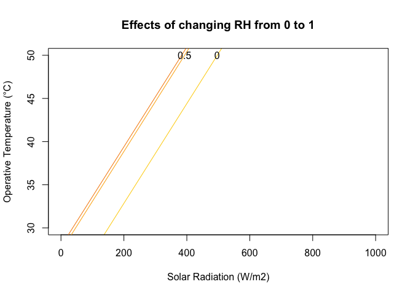

### Model operative temperature with varying wind speeds

``` r
Ts<-40
Ta<-30
SE<-seq(0,1100,100)
Toperative<-NULL
V<-c(0.1,1,2,3,4,5,6,7,8,9,10)

for(V in V){
  temp<-Te(Ts=Ts, Ta=Ta, Tg=NULL, RH=0.5, E=0.96, rho=0.1, cloud=1, SE=SE, V=V, 
           L=0.1, type="forced", shape="vcylinder")
  Toperative<-cbind(Toperative, temp)
}
V<-seq(0,10,1)
Toperative<-data.frame(SE=seq(0,1100,100), Toperative)
colnames(Toperative)<-c("SE", seq(0,10,1))
matplot(Toperative$SE, Toperative[,-1], ylim=c(30, 50), type="l", xlim=c(0,1000),
        main="Effects of Altering Wind Speed from 0 to 10 m/s",
        ylab="Operative Temperature (°C)", xlab="Solar Radiation (W/m2)", lty=1,
        col=flirpal[rev(seq(1,380,35))])
for(i in 2:12){
  ymax<-par()$yaxp[2]
  xmax<-par()$xaxp[2]  
  x<-Toperative[,1]; y<-Toperative[,i]
  lm1<-lm(y~x)
  b<-coefficients(lm1)[1]; m<-coefficients(lm1)[2]
  if(max(y)>ymax) {xpos<-(ymax-b)/m; ypos<-ymax}
  if(max(y)<ymax) {xpos<-xmax; ypos<-y[which(x==1000)]}
  text(xpos, ypos, labels=V[(i-1)])
}
```

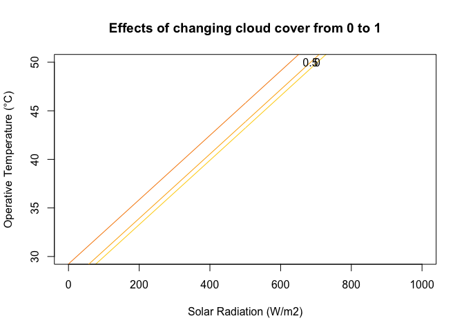

### Model operative temperature with varying RH

``` r
Ts<-40
Ta<-30
SE<-seq(0,1100,100)
Toperative<-NULL
for(RH in seq(0, 1, 0.5)){
  temp<-Te(Ts=Ts, Ta=Ta, Tg=NULL, RH=RH, E=0.96, rho=0.1, cloud=0.5, SE=SE, V=1, 
           L=0.1, type="forced", shape="hcylinder")
  Toperative<-cbind(Toperative, temp)
}
RH<-seq(0, 1, 0.5)
Toperative<-data.frame(SE=seq(0,1100,100), Toperative)
colnames(Toperative)<-c("SE", seq(0,1,0.5))
matplot(Toperative$SE, Toperative[,-1], ylim=c(30, 50), type="l", xlim=c(0,1000),
        main="Effects of changing RH from 0 to 1",
        ylab="Operative Temperature (°C)", xlab="Solar Radiation (W/m2)", lty=1,
        col=flirpal[rev(seq(1,380,35))])
for(i in 2:3){
  ymax<-par()$yaxp[2]
  xmax<-par()$xaxp[2]  
  x<-Toperative[,1]; y<-Toperative[,i]
  lm1<-lm(y~x)
  b<-coefficients(lm1)[1]; m<-coefficients(lm1)[2]
  if(max(y)>ymax) {xpos<-(ymax-b)/m; ypos<-ymax}
  if(max(y)<ymax) {xpos<-xmax; ypos<-y[which(x==1000)]}
  text(xpos, ypos, labels=RH[(i-1)])
}
```


### Model operative temperature with varying cloud cover

``` r
Ts<-40
Ta<-30
SE<-seq(0,1100,100)
Toperative<-NULL
for(cloud in seq(0, 1, 0.5)){
  temp<-Te(Ts=Ts, Ta=Ta, Tg=NULL, RH=0.5, E=0.96, rho=0.5, cloud=cloud, SE=SE, V=1, 
           L=0.1, type="forced", shape="hcylinder")
  Toperative<-cbind(Toperative, temp)
}
cloud<-seq(0, 1, 0.5)
Toperative<-data.frame(SE=seq(0,1100,100), Toperative)
colnames(Toperative)<-c("SE", seq(0,1,0.5))
matplot(Toperative$SE, Toperative[,-1], ylim=c(30, 50), type="l", xlim=c(0,1000),
        main="Effects of changing cloud cover from 0 to 1",
        ylab="Operative Temperature (°C)", xlab="Solar Radiation (W/m2)", lty=1,
        col=flirpal[rev(seq(1,380,35))])
for(i in 2:3){
  ymax<-par()$yaxp[2]
  xmax<-par()$xaxp[2]  
  x<-Toperative[,1]; y<-Toperative[,i]
  lm1<-lm(y~x)
  b<-coefficients(lm1)[1]; m<-coefficients(lm1)[2]
  if(max(y)>ymax) {xpos<-(ymax-b)/m; ypos<-ymax}
  if(max(y)<ymax) {xpos<-xmax; ypos<-y[which(x==1000)]}
  text(xpos, ypos, labels=cloud[(i-1)])
}
```


## References

Angiletta, M. J. 2009. Thermal Adaptation: A Theoretical and Empirical Synthesis. Oxford University Press, Oxford, UK, 304 pp. Gates, D.M. 2003. Biophysical Ecology. Courier Corporation, 656 pp.

Blaxter, 1986. Energy metabolism in animals and man. Cambridge University Press, Cambridge, UK, 340 pp.

Gates, DM. 2003. Biophysical Ecology. Dover Publications, Mineola, New York, 611 pp.

Tattersall, GJ, Andrade, DV, and Abe, AS. 2009. Heat exchange from the toucan bill reveals a controllable vascular thermal radiator. Science, 325: 468-470.

Tattersall GJ, Chaves JA, Danner RM. Thermoregulatory windows in Darwin's finches. Functional Ecology 2017; 00:1–11. <https://doi.org/10.1111/1365-2435.12990>

## Online Resources

The following open source programs and programmers were critical to the development of Thermimage.

Exiftool: <http://www.sno.phy.queensu.ca/~phil/exiftool/>

Imagemagick: <http://imagemagick.org>

Perl: <http://www.perl.org>

raw2temp, temp2raw: <https://github.com/gtatters/ThermimageCalibration>

EEVBlog:

-   raw to temperature conversion: <http://u88.n24.queensu.ca/exiftool/forum/index.php?topic=4898.135>

-   magicbyte import: <http://u88.n24.queensu.ca/exiftool/forum/index.php?topic=4898.0>

-   fileformat: <https://www.eevblog.com/forum/thermal-imaging/csq-file-format/>

Alternative Hex Stickers   
=====================

Previous release notes
======================

- 2019-02-12: Version 3.1.3 is on Github
    - Updated help information to point users to the issues link (https://github.com/gtatters/Thermimage/issues)

- 2018-10-14: Version 3.1.2 (also on CRAN)
    - Removed stop check in readflirJPG and flirsettings functions for troubleshooting custom pathing.

- 2018-09-08: Version 3.1.1 (also on CRAN)
    - Added minor change to readflirJPG function to accomodate whitespace in file pathing. See Issue \#1.

- 2017-11-28: Version 3.1.0 (also on CRAN)
    - Added three new functions for converting FLIR jpg, seq, and csq files calling on command line tools.

- 2017-10-04: Version 3.0.2 is on Github and Cran
    - Minor change to getFrames function to provide reverse ordering of vector.

- 2017-03-24: Version 3.0.1 is on Github and Cran
    - Minor fix to frameLocates to allow functionality with certain fcf files.
    - Minor edits to help files. Cautionary notes added to hconv() regarding limitations to estimating convection coefficients without considering turbulence vs. laminar effects

- March 2017: Version 3.0.0 is on Github & CRAN.
    - Changes in this release include functions for importing thermal video files and exporting for ImageJ functionality
    - Currently testing seq and fcf imports. Please send sample files for testing.

- October 2016: Version 2.2.3 is on CRAN.
    - Changes in this release include readflirjpg and flirsettings functions for processing flir jpg meta tag info.
